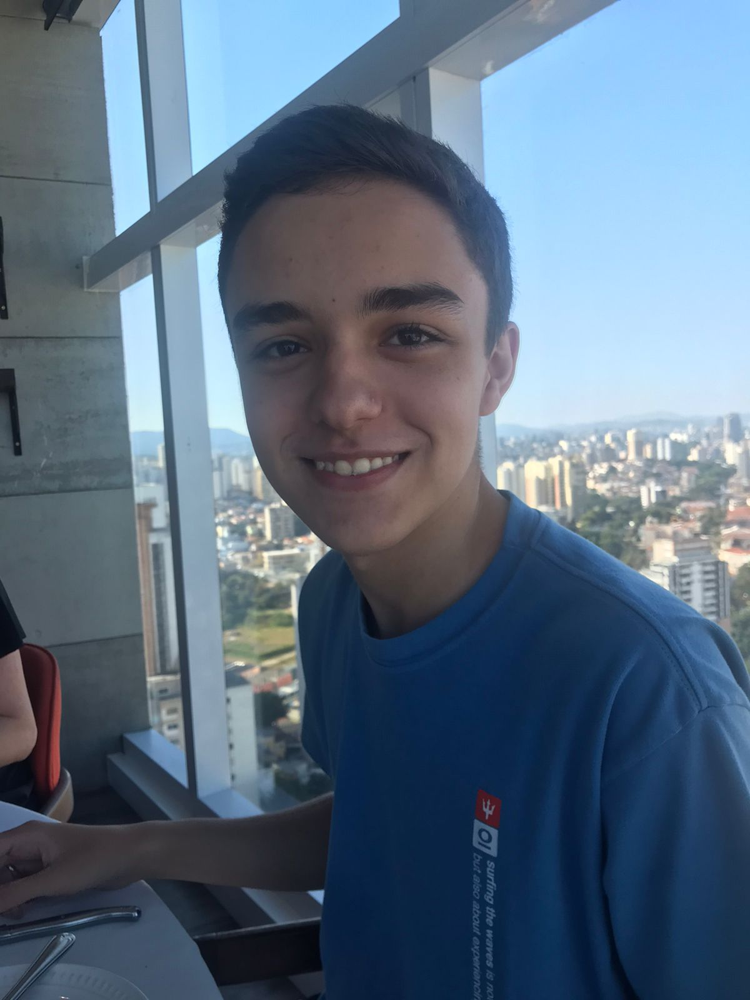
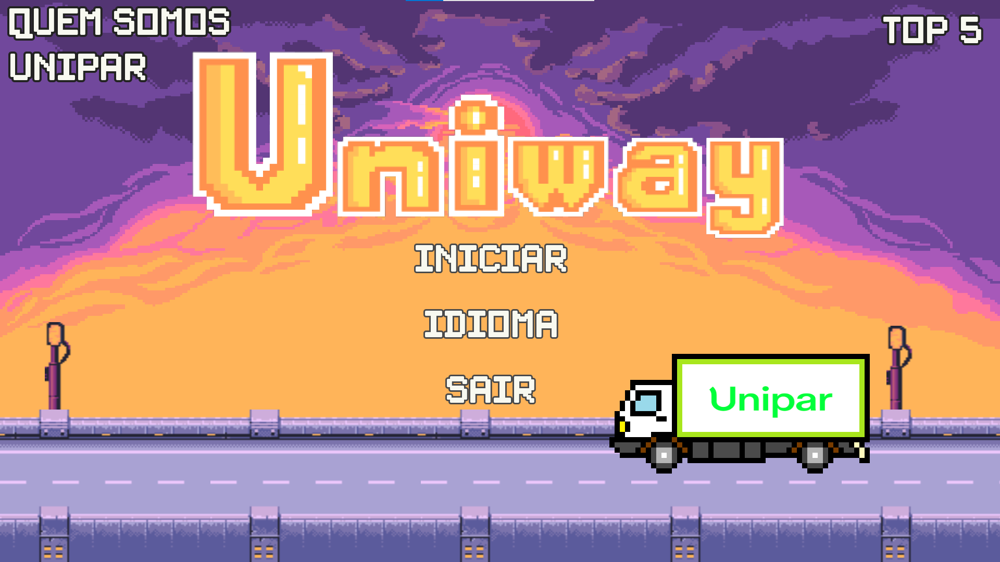

# Inteli - Instituto de Tecnologia e Liderança 

# UniWay

## B3tt3r

## Integrantes: 

  - <td align="left"><a href="https://www.linkedin.com/in/MarceloMiguelAssis"> <b>Marcelo Assis</b></a></td>
  - <td align="center" /td><a href="https://www.linkedin.com/in/guilherme-pardi-87b815264/"> <bu><b>Guilherme Pardi</b></a>
  - <td align="left"><a href="https://github.com/2023M1T6-Inteli/grupo3"> <b>João Caue</b></a></td>
  - <td align="left"><a href="https://github.com/2023M1T6-Inteli/grupo3"> <b>Gustavo Gouveia</b></a></td>
  - <td align="left"><a href="https://github.com/2023M1T6-Inteli/grupo3"> <b>Gabrielle Mitoso</b></a></td>
  - <td align="left"><a href="https://github.com/2023M1T6-Inteli/grupo3"> <b>Marcela</b></a></td>
  - <td align="left"><a href="https://github.com/2023M1T6-Inteli/grupo3"> <b>Breno Santana</b></a></td>
  - <td align="left"><a href="https://github.com/2023M1T6-Inteli/grupo3"> <b>Moyses</b></a></td>

## Descrição

📜 O projeto foi desenvolvido pelo grupo B3tt3r no módulo 1 do Inteli (Instituto de Tecnologia e Liderança). Esse projeto tem como objetivos, conscientizar os motoristas e operadores de carga da empresa parceira Unipar.
  

  Game by B3tt3r

  
May the force be with you!
  

## 🛠 Estrutura de pastas

-Raiz 
| 
|-->docs 
|-->documentos 
  &emsp;|-->antigos 
  &emsp;|GDD.docx ou Documentação.docx 
|-->executáveis 
  &emsp;|-->windows 
  &emsp;|-->android 
  &emsp;|-->HTML 
|-->imagens 
|-->src 
|readme.md 

A pasta raiz contem dois arquivos que devem ser alterados:

<b>README.MD</b>: Arquivo que serve como guia e explicação geral sobre seu projeto. O mesmo que você está lendo agora.

Há também 4 pastas que seguem da seguinte forma:

<b>docs</b>: Aqui estão os arquivos compilados em HTML do jogo.
<b>documentos</b>: Aqui estarão todos os documentos do projeto, mas principalmente o <b>GDD (Game Design Document)/Documentação do Sistema</b>. Há uma pasta <b>antigos</b> onde estarão todas as versões antigas da documentação.

<b>executáveis</b>: Aqui estarão todos os executáveis do jogo, prontos para rodar. Há 2 pastas, uma para binários <b>Windows</b> e uma para a <b>Web/HTML</b>

<b>imagens</b>: Algumas imagens do jogo/sistema e logos prontos para serem utilizados e visualizados, além de algumas fotos dos integrantes do grupo.

<b>src</b>: Nesta pasta irá todo o código fonte do jogo/sistema, pronto para para ser baixado e modificado.

## 🛠 Instalação

<b>Windows:</b>

Não há instalação! Apenas executável!
Encontre o JOGO.exe na pasta executáveis e execute-o como qualquer outro programa.

<b>HTML:</b>

Não há instalação!
Encontre o index.html na pasta executáveis e execute-o como uma página WEB (através de algum browser).

## 💻 Configuração para Desenvolvimento

1 - Faça o download do GODOT e deste repositório.
2 - Abra o GODOT, ao ser prontificado clique em IMPORTAR.
3 - Selecione a pasta onde descompactou este repositório.

Para abrir este projeto você necessita das seguintes ferramentas:

-<a href="https://godotengine.org/download">GODOT</a>

## 🗃 Histórico de lançamentos

A cada atualização os detalhes devem ser lançados aqui.
*
* 0.7.0 - 23/03/2023
    * Implementação da mecânica de garantir pontos
    * Criação da tela de seleção de personagens
    * Criação da sala da secretária
* 0.6.4 - 16/03/2023
    * Implementação de sons no jogo
    * Ranking disponível na tela inicial
* 0.6.0 - 09/03/2023
    * Implementação do sistema de ranking local
    * Salvamento do ranking na máquina
    * Nova tela inicial com aprimoramento de UX
    * Implementação do feedback visual ao perder vida
* 0.5.0 - 06/03/2023
    * Criação do tutorial inicial
    * Implementação da seleção de idiomas
    * Criação de uma HUD, contendo velocímetro, barra de vida
    * Implementação do primeiro obstáculo
* 0.4.0 - 01/03/2023
    * Aprimoramento da usabilidade do jogo
    * Troca da imagem do caminhão para uma aparência mais próxima da Unipar
    * Novo cenário
* 0.3.0 - 22/02/2023
    * Criação do checklkist
    * Aprimoramento do sistema de pause (criação de uma máscara escura)
    * Implementação de uma animação de transição entre as cenas
* 0.2.0 - 17/02/2023
    * Implementação do sistema de pontos
    * Movimentação do caminhão
    * Adição de uma nova fonte para os textos do jogo
    * Primeiro sistema de pause do jogo
* 0.1.0 - 10/02/2023
    * O primeiro lançamento adequado
    * Criação da primeira tela inicial
    * Desenvolvimento do primeiro Level Design
* 0.0.1 - 30/01/2022
    * Início do Projeto

## 📋 Licença/License

<a property="dct:title" rel="cc:attributionURL" href="https://github.com/Spidus/Teste_Final_1">MODELO GIT INTELI</a> by <a rel="cc:attributionURL dct:creator" property="cc:attributionName" href="https://www.yggbrasil.com.br/vr">INTELI, VICTOR BRUNO ALEXANDER ROSETTI DE QUIROZ</a> is licensed under <a href="http://creativecommons.org/licenses/by/4.0/?ref=chooser-v1" target="_blank" rel="license noopener noreferrer" style="display:inline-block;">Attribution 4.0 International</a>

## 🎓 Referências

Aqui estão as referências usadas no projeto.

1. <https://github.com/iuricode/readme-template>
2. <https://github.com/gabrieldejesus/readme-model>
3. <https://creativecommons.org/share-your-work/>
4. <https://freesound.org/>
5. Músicas por: <a href="https://freesound.org/people/DaveJf/sounds/616544/"> DaveJf </a> e <a href="https://freesound.org/people/DRFX/sounds/338986/"> DRFX </a> ambas com Licença CC 0.
